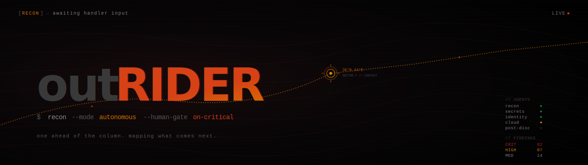

# outrider-recon

> Autonomous agentic recon pipeline for authorized external red-team and bug-bounty. Claude-native -- scopes, enumerates, pivots, and escalates without hand-holding. **81 capabilities** · 48 secret patterns · 70 dorks · 9 read-only validators · 35 attack-path templates.

---

## What is this?

`outrider-recon` is an autonomous agentic recon pipeline built on Claude. Rather than a passive reference, it operates as a senior recon analyst — it plans, executes, pivots on findings, and escalates to impact without waiting to be prompted at each step.

The pipeline is structured as a router + specialized sub-agents, each owning a slice of the external attack surface:

- **`osint-methodology`** — *how to think.* Strategic + procedural. Asset-graph discipline, severity rubric, time budgeting, identity-fabric mapping, deliverable templates.
- **`offensive-osint`** — *router.* Dispatches to the right sub-agent based on task type. Entry point for the pipeline.
- **`recon-asset-discovery`** — subdomains (8-source crt.sh fallback chain), ASN/BGP, CT logs, WHOIS/RDAP, DNS catalog, wordlist sources.
- **`web-surface`** — Swagger/GraphQL probe paths, JS guess-paths, endpoint extraction regexes, vendor fingerprints, subdomain takeover (27 providers), cloud bucket permutation, CDN bypass, Wayback CDX, Postman, endpoint scoring.
- **`identity-fabric`** — Entra, Okta, ADFS, SAML (5 metadata paths), M365 deep enum, GraphQL field-suggestion, LinkedIn employee enum.
- **`secrets-and-dorks`** — 48-pattern secret regex catalog, 70 dork corpus, GitHub code-search dorks, 9 read-only validators.
- **`post-discovery`** — JWT triage, AWS IAM enum, GitHub/Slack post-credential workflows. Gated: run validators first.
- **`cloud-and-infra`** — cloud-native fingerprints, K8s/etcd/kubelet, CI/CD exposure, TLS deep audit.
- **`people-breach-intel`** — HudsonRock, breach data, email-pattern inference, package registry leak hunting (7 registries), Slack/Discord/Mattermost discovery.
- **`analysis-and-reporting`** — scoring rubrics, 35 attack-path hints, 92-row severity decision matrix, sector severity overrides.

---

## Quick Start

### Claude Code

```bash
# 1. Clone and install skills
git clone https://github.com/Ap6pack/outrider-recon.git
mkdir -p ~/.claude/skills
cp -r outrider-recon/skills/* ~/.claude/skills/

# 2. Set up your local Claude config
cp outrider-recon/CLAUDE.md.example outrider-recon/CLAUDE.md
# Edit CLAUDE.md — fill in your platform and handle for traffic tagging
```

Then in any Claude Code session, ask an OSINT question — skills auto-load and trigger on relevant phrases.

### Single Skill

```bash
cat skills/offensive-osint/SKILL.md | claude --system-file -
```

### Manual (Claude.ai / Claude API)

Paste the contents of any `SKILL.md` into a Project's system prompt or prepend it to your conversation. All files are plain Markdown — also usable as a personal cheat-sheet without Claude.

---

## Structure

```
outrider-recon/
├── skills/
│   ├── osint-methodology/SKILL.md     # how to think (pipeline · rubric · anti-patterns · deliverables)
│   ├── offensive-osint/SKILL.md       # router — dispatches to sub-skills below
│   ├── recon-asset-discovery/SKILL.md # subdomains · ASN · CT · DNS · WHOIS · wordlists
│   ├── web-surface/SKILL.md           # probe paths · takeover · buckets · Wayback · Postman
│   ├── identity-fabric/SKILL.md       # Entra · Okta · ADFS · SAML · M365 · LinkedIn
│   ├── secrets-and-dorks/SKILL.md     # 48 regexes · 70 dorks · 9 validators
│   ├── post-discovery/SKILL.md        # JWT · AWS IAM · GitHub · Slack workflows
│   ├── cloud-and-infra/SKILL.md       # cloud-native · K8s · CI-CD · TLS
│   ├── people-breach-intel/SKILL.md   # breach · HudsonRock · email · pkg registries
│   ├── analysis-and-reporting/SKILL.md # scoring · severity matrix · sector overrides
│   └── report-template/SKILL.md       # bug-bounty report scaffold
├── skills/offensive-osint/scripts/
│   ├── h1_reference.py               # HackerOne disclosed-reports reference agent (no API key)
│   └── secret_scan.py                # stdlib-only secret scanner (JSONL output)
├── docs/
│   ├── methods/                       # techniques & procedures (probes · CDN bypass · sweeps · monitoring · multi-tenant · Burp/ZAP)
│   │   ├── continuous-monitoring.md   # daily/weekly diff pipelines · alert architecture · FP tuning
│   │   ├── multi-tenant-workflow.md   # engagement isolation · parallel execution · decommission
│   │   ├── burp-zap-setup.md          # proxy config recipes · extensions · traffic tagging
│   ├── reference/                     # tool directory · install commands · specialty domains
│   ├── architecture.md
│   ├── capabilities.md
│   ├── coverage.md
│   ├── installation.md
│   └── usage.md
├── examples/                          # 4 end-to-end engagement walk-throughs
├── tests/smoke-test-prompts.md        # 43-prompt self-evaluation
├── CLAUDE.md.example                  # copy to CLAUDE.md and customise for your engagement
└── assets/outrider-recon-banner.svg
```

---

## Documentation

| Doc | Contents |
|---|---|
| [`docs/capabilities.md`](docs/capabilities.md) | Full capability index (81 capabilities across 13 domains) + architecture diagrams |
| [`docs/architecture.md`](docs/architecture.md) | Design philosophy · asset-graph model · confidence/severity/detectability models · sidecar coordination |
| [`docs/coverage.md`](docs/coverage.md) | Practitioner-coverage breakdown by archetype + engagement phase |
| [`docs/installation.md`](docs/installation.md) | Symlink installs and multi-environment install patterns |
| [`docs/usage.md`](docs/usage.md) | Trigger-phrase reference and prompt templates |
| [`docs/methods/`](docs/methods/) | Techniques & procedures: copy-paste probes, CDN bypass, active sweeps, anti-patterns, evidence preservation, continuous monitoring, multi-tenant workflow, Burp/ZAP setup |
| [`docs/reference/`](docs/reference/) | Tool directory, install commands, specialty domain guides (healthcare, finance, ICS, IoT, government) |
| [`examples/`](examples/) | 4 end-to-end engagement walk-throughs (quick recon · bug-bounty · M365 deep · secret hunting) |
| [`tests/smoke-test-prompts.md`](tests/smoke-test-prompts.md) | 43-prompt self-evaluation suite |
| [`CHANGELOG.md`](CHANGELOG.md) | Version history |
| [`CONTRIBUTING.md`](CONTRIBUTING.md) | Pull-request guidelines |

---

## Authorization

These skills are intended for assets you **own** or have **written authorization to assess** (red-team rules of engagement, bug-bounty in-scope assets, ASM contracts).

All skills include a soft scope-check when you ask Claude to act against an unverified third-party target. They explicitly **exclude** active exploitation, post-exploitation, malware development, and other activities beyond OSINT-driven reconnaissance. See [`SECURITY.md`](SECURITY.md) for the full posture.

---

## About

Operational tradecraft accumulated across external attack-surface engagements, codified into Claude skills. Engagement-platform agnostic - slot into any ASM / ticketing / asset-graph platform you already use, or none.

**Author:** [Ap6pack](https://github.com/Ap6pack)

**Forked from:** [elementalsouls/Claude-OSINT](https://github.com/elementalsouls/Claude-OSINT)

**Original framework:** [SnailSploit/offensive-checklist](https://github.com/SnailSploit/offensive-checklist) (v1.x)

**Inspired by:** [Bellingcat's Online Investigations Toolkit](https://www.bellingcat.com/resources/2024/09/24/bellingcat-online-investigations-toolkit/) 
· [IntelTechniques](https://inteltechniques.com/tools/) 
· [OSINT Framework](https://osintframework.com/)

**Tool inventory:** 
. [ProjectDiscovery](https://github.com/projectdiscovery) 
· [Six2dez reconftw](https://github.com/six2dez/reconftw) 
· [SecLists](https://github.com/danielmiessler/SecLists) 
· [Assetnote Wordlists](https://wordlists.assetnote.io/)

**License:** [MIT](LICENSE) — use freely, attribution appreciated.

---

> *"Give Claude the right skill and it stops being a chatbot. It becomes an operator."*
