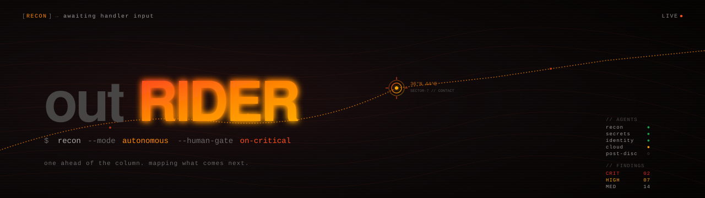

# outrider-recon

[](LICENSE)
[](#project-structure)
[](docs/capabilities.md)
[](#quick-start)
[](mcp-server/)

> **Claude-native external recon and attack-surface management for authorized bug bounty, pentest, and security teams.**

Outrider turns public, read-only recon signals into prioritized, evidence-backed leads. It combines Claude skills, deterministic local controls, optional MCP enrichment, and report scaffolding so operators can understand what exists, why it matters, and where to safely continue.

Outrider is intentionally not an exploitation framework. It is a navigation and control layer for authorized external recon: map the surface, preserve evidence, rank likely attack paths, and hand off to the right next workflow.

---

## Table of contents

- [Overview](#overview)
- [Quick start](#quick-start)
- [How it works](#how-it-works)
- [Capabilities](#capabilities)
- [Example output](#example-output)
- [Installation](#installation)
- [Implementation status](#implementation-status)
- [Releases and versioning](#releases-and-versioning)
- [Current releases](#current-releases)
- [Documentation](#documentation)
- [Project structure](#project-structure)
- [Authorization and security](#authorization-and-security)
- [About](#about)

---

## Overview

Most recon tooling tells you what exists: subdomains, ports, URLs, technologies, leaked files, and scanner output. Outrider focuses on the next question:

> **What matters first, and why?**

Use Outrider to:

- map an organization's authorized external attack surface;
- organize web/API, identity, cloud, SaaS, secrets, people, breach, and public-code signals;
- compare observations against public bug-bounty and attack-path patterns;
- rank leads by confidence, severity, detectability, and operator value;
- preserve local evidence and produce finding cards, technique cards, and report-ready notes;
- keep recon decisions inside deterministic scope, state, approval, and evidence controls.

Outrider fits between raw discovery tools and active testing:

```text
Outrider Recon → ranked leads / technique cards → proxy-assisted testing, manual validation, ASM tickets, or remediation
```

---

## Quick start

This is the minimum successful path. For complete setup options, see [Installation](docs/installation.md) and [Usage](docs/usage.md).

### 1. Install the Claude skills

```bash
git clone https://github.com/Ap6pack/outrider-recon.git
mkdir -p ~/.claude/skills
cp -r outrider-recon/skills/* ~/.claude/skills/
```

### 2. Install or download the Python CLI

From a source checkout:

```bash
cd outrider-recon
python -m pip install -e .
```

For release artifacts and checksum verification, see [Release documentation](docs/releases/README.md).

### 3. Initialize a run

```bash
outrider init example.com \
  --actor authorized-operator \
  --authorization-reference EXAMPLE-ROE-001
```

### 4. Perform one scope check

```bash
outrider scope-check runs/example.com api.example.com
```

### 5. Continue with detailed usage

Use [docs/usage.md](docs/usage.md) for command workflows, Claude prompts, state transitions, evidence handling, approvals, contracts, finding promotion, reporting, and operational patterns.

---

## How it works

```text
Scope → Recon → Enrich → Score → Finding Cards → Handoff → Report
```

- **Claude skills** provide methodology, routing, operator checklists, scoring guidance, and report structure.
- **Python controls** provide deterministic local enforcement for run identity, workflow state, scope checks, approval policy, evidence integrity, contract validation, and finding promotion.
- **Optional MCP tools** provide policy-gated live enrichment for bounded public-source lookups and DNS records.
- **Optional web control plane** provides a local browser interface for creating guarded runs, reviewing run folders, replacing initialized scope rules, checking scope candidates, applying guarded workflow-state transitions, granting/revoking bounded approvals, checking action policy, inventorying artifact metadata, registering existing artifacts as evidence, and verifying evidence integrity; see [web review/control details](docs/web-review-plane.md).

The design keeps reasoning and enrichment separate from durable authorization, scope, evidence, and finding records. See [Architecture](docs/architecture.md), [Contracts](contracts/README.md), and the ADRs under [docs/adr/](docs/adr/) for details.

---

## Capabilities

The current content bundle includes 11 implemented Claude skills, 90 documented capabilities, 48 secret patterns, 70 dorks, 9 read-only validator procedures, 35 attack-path templates, and an optional MCP server for live enrichment.

Capability areas include:

- external asset discovery and surface mapping;
- web, API, JavaScript, documentation, and bucket review;
- identity fabric, SSO, SaaS, cloud, CI/CD, and package-registry signals;
- secrets, public-code, dorking, breach, and people intelligence;
- public disclosure research and bug-bounty technique references;
- evidence-backed analysis, scoring, finding cards, handoff notes, and reports.

See [Capabilities](docs/capabilities.md) for the complete inventory and [Coverage](docs/coverage.md) for practitioner coverage by engagement phase.

---

## Example output

A useful recon workflow should not end with a flat list of hosts. Outrider aims to produce ranked, evidence-backed leads like this:

```text
[HIGH] api.acme.example exposes OpenAPI schema
Confidence: Confirmed
Evidence: GET /openapi.json returned 200; schema includes user/account/order paths
Why it matters: API schema reveals object identifiers and hidden write endpoints
Public report intelligence: similar disclosed reports map to IDOR, mass assignment, and broken authorization patterns
Recommended handoff: hunt-api-misconfig, hunt-idor, Burp Repeater authorization testing
Safe next step: verify auth requirements and object-level authorization without modifying production data
```

See [examples/05-sample-output.md](examples/05-sample-output.md) for a fuller sanitized example.

---

## Installation

Outrider has separate install paths for Claude skills, the Python CLI, optional web extras, and optional MCP server dependencies. The base Python package installs deterministic local controls and the CLI; web control-plane dependencies are installed with the `web` extra; MCP dependencies are installed from `mcp-server/requirements.txt` in a source checkout.

Use [docs/installation.md](docs/installation.md) for supported install patterns, including one-click install, manual Claude Code setup, editable Python installs, web extras, MCP setup, updates, and uninstall steps.

---

## Implementation status

Outrider currently has four implementation domains:

- **Claude skill layer:** implemented and used as the primary operator-facing capability layer.
- **Python CLI controls:** implemented for run scaffolding, local scope/state/evidence/approval/contract/finding checks, and read-only review support.
- **Optional MCP enrichment:** implemented for bounded, policy-gated enrichment tools that require explicit run context before network or DNS activity.
- **Local web control plane:** implemented as a loopback-only control interface with guarded run creation, initialized-only scope replacement, browser scope checks, guarded workflow-state transitions, guarded approval grant/revocation, action-policy checks, metadata-only artifact inventory, existing-artifact evidence registration, evidence-integrity verification, guarded skill request creation, and request/result contract validation; artifact transfer, evidence editing/deletion, result creation/upload, finding promotion, MCP, and recon remain unsupported in the browser.

The repository does not claim to execute full automated recon on its own. It is a controlled harness for authorized recon workflows and safe handoff. See [Architecture](docs/architecture.md), [Web review plane](docs/web-review-plane.md), and [Release readiness](docs/release-readiness.md) for the current product boundary.

---

## Releases and versioning

Outrider uses independent version domains:

- Python package: `0.2.0`
- Claude plugin/content bundle: `3.0.1`
- individual skill frontmatter versions: independent
- JSON contract schema version: `1`

Do not assume the Python package version and Claude plugin/content version move together. Published GitHub release artifacts are checksum-verifiable, but this repository does not claim cryptographic signing or PyPI / Claude Marketplace publication.

See [Release documentation](docs/releases/README.md) for version domains, artifacts, checksums, and release notes. See [Release readiness](docs/release-readiness.md) for maintainer-facing release checks.

---

## Current releases

Python 0.2.0 is published as a GitHub release under tag [`python-v0.2.0`](https://github.com/Ap6pack/outrider-recon/releases/tag/python-v0.2.0), and Claude plugin/content 3.0.1 is published under tag [`plugin-v3.0.1`](https://github.com/Ap6pack/outrider-recon/releases/tag/plugin-v3.0.1). The same `SHA256SUMS` file covers all three release artifacts across both release domains; future release-candidate workflow runs produce unsigned candidate artifacts for maintainer review; the workflow does not publish automatically.

---

## Documentation

| Guide | Purpose |
| --- | --- |
| [Installation](docs/installation.md) | Claude skills, Python CLI, web extras, and MCP setup |
| [Usage](docs/usage.md) | Commands, prompts, and operator workflows |
| [Architecture](docs/architecture.md) | Responsibility boundaries and deterministic controls |
| [Capabilities](docs/capabilities.md) | Complete capability inventory |
| [Coverage](docs/coverage.md) | Practitioner coverage by workflow and engagement phase |
| [Web control plane](docs/web-review-plane.md) | Local control interface with guarded run creation, scope management, scope checks, and workflow-state transitions |
| [Contracts](contracts/README.md) | Skill request/result interchange |
| [MCP server](mcp-server/README.md) | Optional policy-gated enrichment server |
| [Release documentation](docs/releases/README.md) | Versions, artifacts, and checksum verification |
| [Release readiness](docs/release-readiness.md) | Maintainer release checks and readiness status |
| [Security](SECURITY.md) | Authorization and prohibited-use boundaries |

Key architecture decisions are captured in [docs/adr/](docs/adr/), including run state, evidence integrity, approvals, MCP boundaries, contracts, finding promotion, and guarded web control-plane increments. Additional material lives in [docs/methods/](docs/methods/), [docs/reference/](docs/reference/), [examples/](examples/), and [tests/smoke-test-prompts.md](tests/smoke-test-prompts.md).

---

## Project structure

```text
outrider-recon/
├── skills/                  # Claude skills and shared run guidance
├── outrider/                # Python CLI and deterministic local controls
├── mcp-server/              # Optional MCP enrichment server
├── contracts/               # Skill request/result schemas and docs
├── docs/                    # Installation, usage, architecture, ADRs, releases
├── examples/                # Walkthroughs and sanitized output examples
├── tests/                   # Smoke prompts and automated tests
├── assets/                  # README and project assets
├── SECURITY.md              # Authorization and prohibited-use posture
└── README.md                # Public landing page and documentation hub
```

---

## Authorization and security

Outrider is for assets you own or have written authorization to assess, such as red-team rules of engagement, bug-bounty in-scope assets, ASM contracts, and internal security assessments.

The project is built around read-only recon and safe handoff. It explicitly excludes unauthorized testing, credential abuse, destructive validation, malware, persistence, evasion, uncontrolled exploitation, and internal post-exploitation. Deterministic Python controls and optional MCP policy checks help keep local decisions aligned with scope, state, approval, and evidence requirements.

See [SECURITY.md](SECURITY.md) for the full security posture and prohibited-use boundaries.

---

## About

Outrider codifies external attack-surface tradecraft into Claude-native skills, local deterministic controls, and reviewable evidence workflows. It is engagement-platform agnostic: slot it into the ASM, ticketing, asset-graph, bug-bounty, or pentest workflow you already use.

**Author:** [Ap6pack](https://github.com/Ap6pack)
**Forked from:** [elementalsouls/Claude-OSINT](https://github.com/elementalsouls/Claude-OSINT)
**Original framework:** [SnailSploit/offensive-checklist](https://github.com/SnailSploit/offensive-checklist) (v1.x)
**Inspired by:** [Bellingcat's Online Investigations Toolkit](https://www.bellingcat.com/resources/2024/09/24/bellingcat-online-investigations-toolkit/) · [IntelTechniques](https://inteltechniques.com/tools/) · [OSINT Framework](https://osintframework.com/)
**Tool inventory:** [ProjectDiscovery](https://github.com/projectdiscovery) · [Six2dez reconftw](https://github.com/six2dez/reconftw) · [SecLists](https://github.com/danielmiessler/SecLists) · [Assetnote Wordlists](https://wordlists.assetnote.io/)
**License:** [MIT](LICENSE) — use freely, attribution appreciated.

> _Raw recon tells you what exists. Outrider helps decide what matters first._

The optional local web control plane now supports guarded candidate review, explicit human finding promotion, and point-in-time finding verification without adding execution, result upload, reporting, export, or artifact-transfer capabilities.

The optional loopback web control plane can expose explicitly enabled, fixed, policy-gated MCP enrichment controls with `outrider web serve ./runs --enable-mcp-enrichment` after installing `python -m pip install -e ".[web,enrichment]"`. Enrichment is disabled by default; results are transient and do not create artifacts, evidence, contracts, findings, reports, jobs, or arbitrary MCP access.
